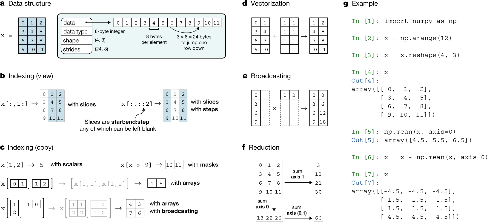

---
jupytext:
  formats: md:myst,ipynb
  text_representation:
    extension: .md
    format_name: myst
    format_version: 0.13
    jupytext_version: 1.14.5
kernelspec:
  display_name: Python 3 (ipykernel)
  language: python
  name: python3
---

```{code-cell} ipython3
---
slideshow:
  slide_type: '-'
---
import os
from pathlib import Path
import numpy as np
import matplotlib.pyplot as plt
%matplotlib inline
```

+++ {"slideshow": {"slide_type": "slide"}}

<center>

# NumPy for Biological Image Analysis

### BeBi 205, May 11th 2023

#### Ross Barnowski, [@rossbar](https://github.com/rossbar) on GitHub

</center>

+++ {"slideshow": {"slide_type": "slide"}}

# Why NumPy?

- `ndarray`: A generic, n-dimensional array data structure
  * Fundamental data structure underlying the *Scientific Python Ecosystem*

+++ {"slideshow": {"slide_type": "subslide"}}

<center>

## The Scientific Python Ecosystem


</center>

Image credit: Jarrod Millman et. al. - [Array programming with NumPy][numpy-paper]

[numpy-paper]: https://www.nature.com/articles/s41586-020-2649-2

+++ {"slideshow": {"slide_type": "slide"}}

# A Bit of History

+++ {"slideshow": {"slide_type": "fragment"}}

- **Mid 90's/Early 00's**: desire for high-performance numerical computation in
  Python culminates in the `Numeric` [(pdf)][numeric-manual] library.

[numeric-manual]: https://numpy.org/_downloads/768fa66c250a0335ad3a6a30fae48e34/numeric-manual.pdf

+++ {"slideshow": {"slide_type": "fragment"}}

- Early adopters included the [Space Telescope Science Institute (STScI)][stsci]
  who adapted Numeric to better suit their needs: `NumArray`.

[stsci]: http://www.stsci.edu/

+++ {"slideshow": {"slide_type": "fragment"}}

- **2005** The best ideas from `Numeric` and `NumArray` were combined in the
  development of a new library: `NumPy`
   * Originally `scipy.core` rather than a standalone library.
   * This work was largely done by [Travis Oliphant][travis-gh],
     then an assistant professor at BYU.

[travis-gh]: https://github.com/teoliphant

+++ {"slideshow": {"slide_type": "fragment"}}

- **2006** NumPy v1.0 released in October

+++ {"slideshow": {"slide_type": "slide"}}

# Changing Landscape

+++ {"slideshow": {"slide_type": "fragment"}}

- In the early days, many new NumPy users were converts from languages like
  Matlab and IDL
   * See e.g. the [NumPy for Matlab users][numpy4matlab] article in the docs.

[numpy4matlab]: https://numpy.org/doc/stable/user/numpy-for-matlab-users.html

+++ {"slideshow": {"slide_type": "fragment"}}

 - **Now**: The scientific Python ecosystem (including libraries for data
   science and ML) is incredibly feature-rich and powerful, and is attracting
   many new users.
   * Users interested in specific domains or applications (machine learning,
     image processing, geoscience, bioinformatics, etc.) end up interacting
     with NumPy indirectly.

+++ {"slideshow": {"slide_type": "subslide"}}

## Google Trends

```{code-cell} ipython3
---
slideshow:
  slide_type: fragment
---
# Data downloaded from google trends on 05-07-2023
# Each term downloaded individually; time window = 09/01/2010 - 05/07-2023;
# NOTE: Data from US only (Google trends default)
gt_data_path = Path.cwd() / "data/google_trends"
print([f.name for f in gt_data_path.iterdir()])
```

```{code-cell} ipython3
---
slideshow:
  slide_type: fragment
---
!head data/google_trends/data_science.csv
```

```{code-cell} ipython3
---
slideshow:
  slide_type: subslide
---
timeseries_dtype = np.dtype([('date', 'datetime64[M]'), ('relpop', float)])

parse_kwargs = {
    "skiprows" : 3,
    "delimiter" : ",",
    "dtype" : timeseries_dtype
}

data = {
    ff.name[:-4] : np.loadtxt(ff, **parse_kwargs) for ff in gt_data_path.iterdir()
}
```

```{code-cell} ipython3
---
slideshow:
  slide_type: subslide
---
fig, ax = plt.subplots()
for name, vals in data.items():
    plt.plot(vals['date'], vals['relpop'], label=name)
ax.set_title('Google Trends (US): 2010 - Present')
ax.set_ylabel('Relative Popularity of Search Term [arb]')
fig.autofmt_xdate()
ax.legend();
```

```{code-cell} ipython3
---
slideshow:
  slide_type: subslide
---
def smooth(s, kernsize=21):
    s_padded = np.hstack((s[kernsize-1:0:-1], s, s[-2:-kernsize-1:-1]))
    kern = np.hamming(kernsize)
    res_padded = np.convolve(kern/kern.sum(), s_padded, mode='valid')
    # De-pad and renormalize
    return 100 * res_padded[kernsize//2:-kernsize//2+1] / res_padded.max()
```

```{code-cell} ipython3
---
slideshow:
  slide_type: slide
---
fig, ax = plt.subplots()
for name, vals in data.items():
    plt.plot(vals['date'], smooth(vals['relpop']), label=name)
ax.set_title('Google Trends (US): 2010 - Present')
ax.set_ylabel('Relative Popularity of Search Term [arb]')
ax.legend();
```

+++ {"slideshow": {"slide_type": "subslide"}}

## Takeaways

+++ {"slideshow": {"slide_type": "fragments"}}

- From this *very non-rigorous* analysis, it's not unreasonable to think that
  a greater fraction are driven by interests in data science/machine learning

+++ {"slideshow": {"slide_type": "fragments"}}

- Perhaps greater fraction of new users interacting with NumPy **indirectly**;
  i.e. in the course of their research, rather than from a ground-up approach
  to numerical computing.

+++ {"slideshow": {"slide_type": "subslide"}}

No matter how you slice[^1] it, a thorough understanding of the n-dimensional
array data structure is important!

[^1]: Pun absolutely intended

+++ {"slideshow": {"slide_type": "slide"}}

# NumPy Array at a glance

`ndarray`: a generic, n-dimensional array structure for in-memory,
homogenously-typed data on CPUs.
- Supports a wide range of operations for accessing/manipulating data with a
  concise and expressive syntax.

+++ {"slideshow": {"slide_type": "fragments"}}

## Key concepts

- The **strided memory model**

- The two flavors of **indexing**: basic & advanced

- **Vectorization** & **Broadcasting**

+++ {"slideshow": {"slide_type": "subslide"}}

<center>

</center>
Image credit: Jarrod Millman et. al. - [Array programming with NumPy][numpy-paper]

+++ {"slideshow": {"slide_type": "slide"}}

# The strided memory model

- Data are stored linearly in computer memory

- NumPy arrays *describe* the data in memory allowing it to be interpreted
  a multi-dimensional array of elements.
  * Need to know how to interpret individual elements: `dtype`
  * Need to map from a multi-dimensional indexing scheme to memory block

- Turns out this requires only a few bits of information:
  * the number of dimensions and the size of each dimension, i.e. the array `shape`
  * the number of bytes one needs to "jump" to reach the next element in each
    dimension: `strides`

+++ {"slideshow": {"slide_type": "subslide"}}

## Example

The strided indexing scheme allows us to interpret the memory block as a
2D array:

```{code-cell} ipython3
a = np.array([[0, 6, 1], [3, 4, 2]], dtype=np.uint8)
a
```

The `.data` attribute points to the underlying data buffer in memory:

```{code-cell} ipython3
a.data
```

```{code-cell} ipython3
# NOTE: for illustrative purposes only, not recommended for user code
bytes(a.data)
```

```{code-cell} ipython3
idx = (1, 2)
a[idx]
```

+++ {"slideshow": {"slide_type": "subslide"}}

Mapping back to the 1D data buffer:

```{code-cell} ipython3
a.strides  # note: strides are in *bytes*
```

```{code-cell} ipython3
idx_1d = a.strides[0] * idx[0] + a.strides[1] * idx[1]
idx_1d
```

```{code-cell} ipython3
bytes(a.data)[idx_1d]
```

+++ {"slideshow": {"slide_type": "fragment"}}

See also [`np.ravel_multi_index`][np-rmi]

[np-rmi]: https://numpy.org/devdocs/reference/generated/numpy.ravel_multi_index.html

+++ {"slideshow": {"slide_type": "slide"}}

# Contiguous Memory

- A contiguous memory layout is one where there are no gaps between the elements.

- There is a fundamental ambiguity in how the higher-dimensional index is
  mapped back to 1D

The 1D memory block can either be filled such that the elements in the **rows**
are adjacent to each other in memory, or such that the elements in the **columns**
are adjacent.

For historcal reasons related to the `C` and `Fortran` programming languages,
C-contiguous == row-major and F-contiguous == column-major

+++ {"slideshow": {"slide_type": "slide"}}

## Example

Let's say we want to represent the following 2D array:

```python
[[1, 2, 3],
 [4, 5, 6],
 [7, 8, 9]]
```

```{code-cell} ipython3
---
slideshow:
  slide_type: subslide
---
x = np.array([[1, 2, 3], [4, 5, 6], [7, 8, 9]], dtype=np.uint8, order="C")
x
```

```{code-cell} ipython3
x.strides  # Last index "varies the fastest" (smallest stride)
```

```{code-cell} ipython3
x.tobytes("A")  # order="A" preserves the ordering of the underlying memory buffer
```

```{code-cell} ipython3
y = np.array(x, order="F")  # Same data stored in a different order
y
```

```{code-cell} ipython3
y.strides  # First index "varies the fastest" (smallest stride)
```

```{code-cell} ipython3
y.tobytes("A")
```

+++ {"slideshow": {"slide_type": "slide"}}

## Question: Is it possible to have memory layouts that are neither F nor C contiguous?

```{code-cell} ipython3
# What do you think?
```

+++ {"slideshow": {"slide_type": "subslide"}}

## Another Question: Is it possible to have non-contiguous memory in 2D?

```{code-cell} ipython3
# You tell me!
a = np.arange(12).reshape(3, 4)
a
```

+++ {"slideshow": {"slide_type": "subslide"}}

### Aside

Understanding the strided memory model can help you determine if/when numpy
will copy data.
 - NumPy generally tries not to copy data (see e.g. `reshape()`, `ravel()`), but
   sometimes there is no way to represent the output array with a given shape
   with only strides + data offset

```{code-cell} ipython3
b = a[1:].ravel()  # Returns a view
print(b.flags)
b
```

```{code-cell} ipython3
c = a[:2, 1:3].ravel()  # Copies: no way to represent the raveled data with stride only
print(c.flags)
c
```

+++ {"slideshow": {"slide_type": "slide"}}

# The power of the strided memory model

- Can represent any regular multidimensional data with only `shape`, and `strides`
  (and in some cases adjusting the `data` pointer)

- The same memory block can be viewed in different ways *without copying the data*
  * e.g. reshaping, transposing
  * Also **basic indexing**, i.e. multi-dimensional slicing, which never copies data

- Can have "virtual" dimensions by using strides of 0 -> **array broadcasting**
  * Again, can help avoid copying data/allocating temporary arrays

+++ {"slideshow": {"slide_type": "fragment"}}

For a more thorough treatment of the strided memory model, see:
 - [A Guide to NumPy][numpy-book], esp. Ch. 2.3
 - [Advanced NumPy in the scipy-lecture-notes][sln]

+++ {"slideshow": {"slide_type": "slide"}}

# Some caveats

- *Views* make it possible to work with large array data in a memory-efficient
  way, but there are some tradeoffs

+++ {"slideshow": {"slide_type": "subslide"}}

## Contrived example

```{code-cell} ipython3
a = np.ones((20000,))

step = 128
b = np.ones((20000 * step,))[::step]
```

```{code-cell} ipython3
np.array_equal(a, b)
```

```{code-cell} ipython3
%timeit a.sum()
```

```{code-cell} ipython3
%timeit b.sum()
```

+++ {"slideshow": {"slide_type": "subslide"}}

## Why?

[Check out the scipy lecture notes!][sli-cpu-cache]

[sli-cpu-cache]: https://scipy-lectures.org/advanced/advanced_numpy/#cpu-cache-effects

+++ {"slideshow": {"slide_type": "subslide"}}

## (Slightly) less contrived example

The dreaded batch/channel swap!

```{code-cell} ipython3
rng = np.random.default_rng(0xdeadc0de)
data_in = rng.random((1, 1024, 1024, 40))
data_in.nbytes / 1e6
```

```{code-cell} ipython3
# Some pre-processing prior to submitting to the model (thresholding, normalization, etc)
# ...
# Final step: swap batch and channel dims
data_out = np.transpose(data_in, (3, 1, 2, 0))
data_out.shape
```

```{code-cell} ipython3
%timeit -n1 -r1 np.save("/tmp/cxyb.npz", data_out)
```

```{code-cell} ipython3
# Beware: ascontiguousarray copies the data! Still faster even with the copy
%timeit -n1 -r1 np.save("/tmp/cxyb.npz", np.ascontiguousarray(data_out))
```

```{code-cell} ipython3
# Even better - if you can engineer your pipeline to load memory from
# disk in the order you want
data_out = np.ascontiguousarray(data_out)  # i.e. no transpose was necessary
%timeit -n1 -r1 np.save("/tmp/cxyb.npz", data_out)
```

+++ {"slideshow": {"slide_type": "slide"}}

# Basic Indexing

- [Basic indexing][basic-idx] occurs whenever the indices are limited to scalars and slices

- Basic indexing always returns *views*, i.e. no data copying
  * As mentioned, saves memory
  * Modifications to either array affect the other, since they point to the
    same memory

[basic-idx]: https://numpy.org/doc/stable/user/basics.indexing.html#basic-indexing

```{code-cell} ipython3
---
slideshow:
  slide_type: subslide
---
a = np.arange(12, dtype=int).reshape(2, 2, 3)
a
```

```{code-cell} ipython3
b = a.reshape(-1)  # Equivalent to ravel()
```

```{code-cell} ipython3
b[3:9] = 100
a
```

```{code-cell} ipython3
a[-1] = 1000
b
```

+++ {"slideshow": {"slide_type": "slide"}}

## Example: Tiling

```{code-cell} ipython3
import tifffile as tff
# Image from deepcell intro
img = tff.imread("data/example_input_combined.tif")
img.shape
```

```{code-cell} ipython3
fig, ax = plt.subplots(1, 2, figsize=(8, 6))
for a, im, ttl in zip(ax.ravel(), img, ("nuclear", "membrane")):
    a.imshow(im)
    a.set_title(f"{ttl.capitalize()} channel")
```

+++ {"slideshow": {"slide_type": "slide"}}

For the sake of argument, let's say the input layer requires images of shape
100x100 pixels.

A common pattern:
 - Pad the input image so that the tile size partitions the space evenly
 - Allocate an output array with shape `(num_tiles, w, h, num_channels)`
 - Populate this array, keeping a separate mapping of tile -> coordinates in
   the original image

+++ {"slideshow": {"slide_type": "fragment"}}

Something like:

```{code-cell} ipython3
---
slideshow:
  slide_type: subslide
---
tile_size = 100  # in both w & h dimensions
img.shape
```

```{code-cell} ipython3
# Therefore...
desired_shape = 600
pad_size = (desired_shape - img.shape[1]) // 2
pad_size
```

```{code-cell} ipython3
img_padded = np.pad(img, ((0, 0), (pad_size,)*2, (pad_size,)*2))
img_padded.shape
```

```{code-cell} ipython3
---
slideshow:
  slide_type: subslide
---
fig, ax = plt.subplots(1, 2, figsize=(16, 6))
for a, im, tt in zip(ax.ravel(), img_padded, ("nuclear", "membrane")):
    a.imshow(im)
    a.set_title(f"{ttl.capitalize()} channel")
```

```{code-cell} ipython3
model_input = np.zeros(
    ((img_padded.shape[1] // tile_size)**2, tile_size, tile_size, 2),
    dtype=img_padded.dtype,
)
model_input.shape
```

From here:

```python
# for idx, tile in enumerate(image):
#     model_input[i] = tile
# batch_size = blah
# for i in range(0, model_input.shape[0], batch_size):
#     batch_out = model.predict(model_input[i:i+batch_size, ...]
# etc.
```

+++ {"slideshow": {"slide_type": "subslide"}}

- One drawback: pre-allocating `model_input` means you need 2x the amount of
  memory as the input image.
  * Can become an issue for larger images, especially if they're multiplexed etc.

+++ {"slideshow": {"slide_type": "fragment"}}

What if instead we created a *mapping* of tiles to their original slices.

+++ {"slideshow": {"slide_type": "fragment"}}

- Reduces the pre-model memory footprint by factor of 2

- Use the same mapping to "untile" the output image

```{code-cell} ipython3
step = 100

tiles = {}
for xstart in np.arange(img_padded.shape[1], step=100):
    for ystart in np.arange(img_padded.shape[2], step=100):
        xbounds, ybounds = (xstart, xstart + step), (ystart, ystart + step)
        xslice, yslice = slice(*xbounds), slice(*ybounds)
        tiles[(xbounds, ybounds)] = img_padded[:, xslice, yslice]
```

```{code-cell} ipython3
tiles.keys()
```

```{code-cell} ipython3
plt.figure();
plt.imshow(tiles[((300, 400), (300, 400))][0, ...])
```

```{code-cell} ipython3
---
slideshow:
  slide_type: slide
---
# Now, the batch loop would look something like:

# Pick whatever we want, though the below assumes that the total number of
# tiles is divisble by batch size (easy to generalize)
batch_size = 4

# Let's assume the model takes in 2-channel images, and spits out single-channel
# predictions.
model_output = np.zeros(img_padded.shape[1:])

# The total CPU memory allocation is now: img_padded.nbytes + batch.nbytes +
# model_output.nbytes
batch = np.zeros((batch_size, tile_size, tile_size, 2))  # Simple example: square images
bounds = list(range(batch_size))  # For holding tile indices over batching
for idx, ((xb, yb), tile) in enumerate(tiles.items()):
    batch[idx % batch_size] = tile.transpose((1, 2, 0))
    bounds[idx % batch_size] = (slice(*xb), slice(*yb))
    # Send batch to model for prediction, and map results back to the
    # pre-allocated output image
    if (idx + 1) % batch_size == 0:
        # World's worst deep learning model: sum the channels
        # Just transforming data to the appropriate shape for illustration purposes
        output = batch.sum(axis=-1)
        # Map prediction to output image
        for loc, prediction in zip(bounds, output):
            model_output[loc] = prediction
```

+++ {"slideshow": {"slide_type": "subslide"}}

Our "model" simply combined the channels - let's see how it did:

```{code-cell} ipython3
plt.figure()
plt.imshow(model_output)
```

```{code-cell} ipython3
np.array_equal(model_output, img_padded.sum(axis=0))
```

+++ {"slideshow": {"slide_type": "slide"}}

Seems... fine.

Not the clearest code but also not an unreasonable refactor to reduce
total memory footprint.

What about padding though, there's something unsatisfying about that...

+++ {"slideshow": {"slide_type": "subslide"}}

- For one thing, our data efficiency is not very good:

```{code-cell} ipython3
img.nbytes / img_padded.nbytes
```

+++ {"slideshow": {"slide_type": "fragment"}}

- A decent chunk of the data we transfer over to the GPU(s) is just cruft from
  zero-padding
  * Even if the model is doing masked computation, still a waste of GPU memory

+++ {"slideshow": {"slide_type": "fragment"}}

- What if instead of padding, we wanted to do overlapping tiles?

+++ {"slideshow": {"slide_type": "subslide"}}

- This is mostly an excuse to show a little-known numpy feature that makes
  extensive use of the strided memory model: `sliding_window_view`
  * Who says location in the memory buffer has to have a *unique* multidimensional
    index?!

```{code-cell} ipython3
img.shape  # A reminder...
```

```{code-cell} ipython3
strided = np.lib.stride_tricks.sliding_window_view(
    img, window_shape=(step, step), axis=(1, 2)
)
strided.shape
```

+++ {"slideshow": {"slide_type": "subslide"}}

We now have a `2 x (width - step) x (height - step)` array of `step x step` tiles!

We could use this sliding window view to construct a 6x6 grid of tiles with
basic indexing:

```{code-cell} ipython3
grid_size = 6  # From previous example
grid_stride = int(np.ceil(strided.shape[1] / grid_size))
tile_grid = strided[:, ::grid_stride, ::grid_stride, ...]
tile_grid.shape
```

+++ {"slideshow": {"slide_type": "subslide"}}

How does it look? Let's compare the top row of tiles for the nuclear channel:

```{code-cell} ipython3
plt.figure(figsize=(12, 3))
plt.imshow(img[0, :100, :])
```

```{code-cell} ipython3
fig, ax = plt.subplots(1, grid_size, figsize=(12, 3))
vmax = img[0, :100].max()  # So that all tiles have the same color range

for tile, a in zip(tile_grid[0, :, ...], ax.ravel()):
    a.imshow(t, vmax=vmax)
```

+++ {"slideshow": {"slide_type": "fragment"}}

How could this be improved? How would you do it?

+++ {"slideshow": {"slide_type": "subslide"}}

A quirk:

```{code-cell} ipython3
tile_grid[0, :, ...] /= vmax
```

```{code-cell} ipython3
tile_grid.flags
```

+++ {"slideshow": {"slide_type": "slide"}}

# Takeaways

- Basic indexing can really help reduce the memory footprint of code.

- May require re-thinking your analysis to take full advantage of memory views

+++ {"slideshow": {"slide_type": "slide"}}

# Advanced indexing

- [Advanced indexing][adv-idx] is triggered when the indexing object (i.e. the
  thing inside the brackets) is a non-tuple sequence object.

- Two primary use-cases:
  * **Boolean indexing**: conditional selection of values
  * **Array indexing**: selecting values in an array by their coordinates

- Advanced indexing *always* creates copies

- The result of an advanced indexing operation is 1D

[adv-idx]: https://numpy.org/doc/stable/user/basics.indexing.html#advanced-indexing

+++ {"slideshow": {"slide_type": "slide"}}

## Example: Julia sets

Use Boolean masking to limit the computation to the relevant subset of data

```{code-cell} ipython3
# Complex plane spanning [-2, 2], [-2i, 2i]
x = np.linspace(-2, 2, 2000)
z = x + x[:, np.newaxis]*1j

# Keep track of when values in the plane diverge under iterative function application
div_step = np.zeros(z.shape, dtype=np.uint8)

# f(z) = z**2 - 1
for _ in range(10):
    div_step[np.abs(z) < 2.0] += 1  # Increment counter at values below the divergence thresh
    z = z ** 2 - 1
```

```{code-cell} ipython3
plt.figure()
plt.imshow(div_step, extent=[-2, 2, -2, 2])
```

Cool.

Can we improve this?

+++ {"slideshow": {"slide_type": "fragment"}}

We only need to compute the subsequent iterations for values that have note
yet diverged!


```{code-cell} ipython3
z = x + x[:, np.newaxis]*1j
div_step = np.zeros(z.shape, dtype=np.uint8)

# f(z) = z**2 - 1
for _ in range(10):
    conv_mask = np.abs(z) < 2.0
    div_step[conv_mask] += 1  # Increment counter at values below the divergence thresh
    z[conv_mask] = z[conv_mask] ** 2 - 1
```

+++ {"slideshow": {"slide_type": "fragment"}}

- Improved performance

- Get rid of invalid value warnings

+++ {"slideshow": {"slide_type": "fragment"}}

For more on Julia sets, check out:
 - [The matplotlib gallery][mpl-mandelbrot]
 - [NumPy Tutorials][npt-mandelbrot]

[mpl-mandelbrot]: https://matplotlib.org/stable/gallery/showcase/mandelbrot.html
[npt-mandelbrot]: https://numpy.org/numpy-tutorials/content/tutorial-plotting-fractals.html

+++ {"slideshow": {"slide_type": "slide"}}

## Advanced Indexing: Arrays of indices

- Useful for assigning to/extracting from arrays by coordinate location

- e.g. an upper triangular array

```{code-cell}
a = np.arange(16).reshape(4, 4)
tril_idx = np.tril_indicies(a.size)
tril_idx  # 2 arrays of same length with x and y coords, respectively
```

```{code-cell}
a[tril_idx] = 0
a
```

+++ {"slideshow": {"slide_type": "slide"}}

### Mapping points to coordinates

For example, generating a binary occupancy mask from a collection of 3D points:

```{code-cell}
!head data/neuron_trace.csv
```

```{code-cell}
xyz = np.loadtxt(
    "data/neuron_trace.csv", usecols=(2, 3, 4), unpack=False
)
```

```{code-cell}
fig = plt.figure()
ax = fig.add_subplot(111, projection="3d")
ax.scatter3D(*xyz.T)
```

+++ {"slideshow": {"slide_type": "slide"}}

Generating an occupancy mask with advanced indexing:

```{code-cell}
occ_mask = np.zeros((2048, 2048, 127), dtype=bool)
```

```{code-cell}
# Naive conversion of point locations to coordinate grid by casting to int
idx = xyz.astype(np.intp)
x, y, z = idx.T  # Unpack
occ_mask[x, y, z] = True
occ_mask.sum()
```

TODO: organize below

+++ {"slideshow": {"slide_type": "slide"}}

# Don't forget about Python's data structures!

- A common pattern amongst users: NumPy is written in C, so it's faster across
  the board.

- Not so fast: choosing the right data structure is important!

+++ {"slideshow": {"slide_type": "subslide"}}

## Trivial example

```{code-cell} ipython3
rng = np.random.default_rng()
data = rng.integers(low=0, high=1000, size=int(1e7))
```

- Now let's say you have a task that involves repeatedly checking whether or not
  a value is in this dataset. No problem!:

```{code-cell} ipython3
val = 6000
val in data
```

- But wait... this has to search through *all* of `data` to determine whether
  `val` is present.
  * We know a-priori that there are duplicate values in our dataset, so we can
    optimize this task by only searching over *unique* values in `data`.

```{code-cell} ipython3
uniq_data = np.unique(data)
val in uniq_data
```

+++ {"slideshow": {"slide_type": "subslide"}}

How much did we improve?

```{code-cell} ipython3
%timeit -n 1 -r 1 val in data
```

```{code-cell} ipython3
%timeit -n 1 -r 1 val in uniq_data
```

- Great! An optimized implementation, and still readable!

- But wait... IIRC from CS1, membership testing is `O(n)` for lists. Is there
  a better way?

```{code-cell} ipython3
---
slideshow:
  slide_type: subslide
---
set_data = set(data)
```

```{code-cell} ipython3
%timeit -n 1 -r 1 val in uniq_data
```

```{code-cell} ipython3
%timeit -n 1 -r 1 val in set_data
```

+++ {"slideshow": {"slide_type": "subslide"}}

Cost of construction:

```{code-cell} ipython3
%timeit -n 1 -r 1 uniq_data = np.unique(data)
```

```{code-cell} ipython3
%timeit -n 1 -r 1 set_data = set(data)
```

+++ {"slideshow": {"slide_type": "subslide"}}

## Takeaway

- Binary extensions do not always equal better performance.

- Python has many excellent built-in data structures. Learning to use them
  together with Scientific Python will improve your code.

- I strongly recommend [Fluent Python][fluent-python]

[fluent-python]: https://www.oreilly.com/library/view/fluent-python-2nd/9781492056348/

+++ {"slideshow": {"slide_type": "subslide"}}

# Takeaways

- Developing a stronger understanding of the underlying memory model of any
  data structure is important!
  * Especially as data scales up!

- Often a fundamental tradeoff between computation time and memory requirements
  * Which end up being bottlenecks ends up being problem/data scale dependent

+++ {"slideshow": {"slide_type": "fragment"}}

> The real proglem is that programmers have spent far too much time worrying
> about efficiency in the wrong places and at the wrong times;
> **premature optimization is the root of all evil (or at least most of it) in programming**
> - Donald Knuth, The Art of Computer Programming

+++ {"slideshow": {"slide_type": "fragment"}}

- Avoid *paralysis by analysis*
  * Solve problems with performance as they arise, rather than over-engineering
    for things you *expect might* become problems.

+++ {"slideshow": {"slide_type": "fragment"}}

- Relevant [xkcd](https://xkcd.com/1205/)

+++ {"slideshow": {"slide_type": "subslide"}}

- In my experience, focusing on clear expression of ideas in code is far more
  beneficial than worrying about optimal/performant solutions.

- Collaboration is the fastest way to improve as a programmer
  * Don't be afraid of sharing your code because it's "bad"!

+++ {"slideshow": {"slide_type": "fragment"}}

> The best way to get the right answer is to put the wrong answer on the
> internet
> - Anonymous

+++ {"slideshow": {"slide_type": "fragment"}}

- But... there are a lot of jerks out there: find people that you like
  working with (and try not to be one of the jerks!)

+++ {"slideshow": {"slide_type": "slide"}}

Interested in open source? Scientific software? Python? Any/all of the above?

<center>
Let's chat! 

rossbar@caltech.edu
</center>

% XArray example: CODEX data

% Advanced indexing
% Also indices: 2 examples, point-wise data to grid (neuron example)

% Do's and dont's
% - no masked array
% - no matrix
% - no ragged arrays
% - Most important: premature optimization is the root of all evil
%   * The real power of Python is enabling analysts to explore, express, and
%   * communicate analyses. If you spend all your time worrying about whether
%   * something is written "well", it defeats the purpose
%   * Problems/bottlenecks will naturally present themselves with scale. The
%   * "art" of scientific computing is knowing where they arise (or at least how
%   * to *investigate* how they arise), and how best to solve them.

% Gotchas
% - Relying on `base` as an indicator whether or not an array owns memory
% - Floating point precision
%   * e.g. `arange` with fp step
% - Casting esp. int -> float
