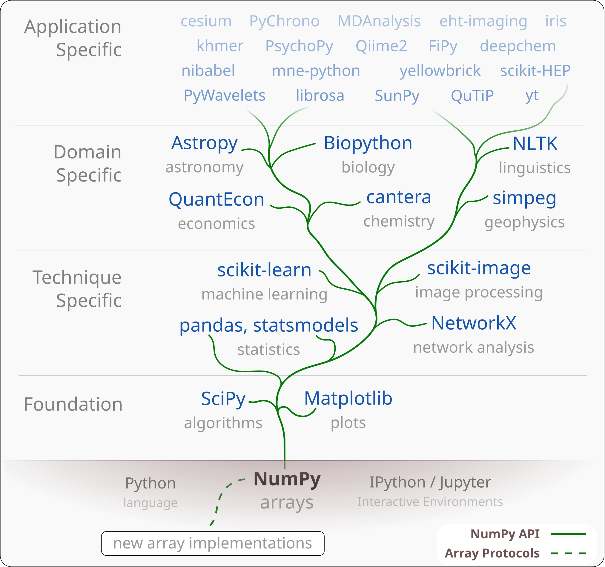

---
jupytext:
  formats: md:myst,ipynb
  text_representation:
    extension: .md
    format_name: myst
    format_version: 0.13
    jupytext_version: 1.14.5
kernelspec:
  display_name: Python 3 (ipykernel)
  language: python
  name: python3
---

```{code-cell} ipython3
---
slideshow:
  slide_type: '-'
---
import os
from pathlib import Path
import numpy as np
import matplotlib.pyplot as plt
%matplotlib notebook
```

+++ {"slideshow": {"slide_type": "slide"}}

<center>

# NumPy for Biological Image Analysis

### BeBi 205, May 11th 2023

#### Ross Barnowski, [@rossbar](https://github.com/rossbar) on GitHub

</center>

+++ {"slideshow": {"slide_type": "slide"}}

# Why NumPy?

- `ndarray`: A generic, n-dimensional array data structure
  * Fundamental data structure underlying the *Scientific Python Ecosystem*

+++ {"slideshow": {"slide_type": "subslide"}}

<center>

## The Scientific Python Ecosystem



</center>

Image credit: Jarrod Millman et. al. - [Array programming with NumPy][numpy-paper]

[numpy-paper]: https://www.nature.com/articles/s41586-020-2649-2

+++ {"slideshow": {"slide_type": "slide"}}

# A Bit of History

+++ {"slideshow": {"slide_type": "fragment"}}

- **Mid 90's/Early 00's**: desire for high-performance numerical computation in
  Python culminates in the `Numeric` [(pdf)][numeric-manual] library.

[numeric-manual]: https://numpy.org/_downloads/768fa66c250a0335ad3a6a30fae48e34/numeric-manual.pdf

+++ {"slideshow": {"slide_type": "fragment"}}

- Early adopters included the [Space Telescope Science Institute (STScI)][stsci]
  who adapted Numeric to better suit their needs: `NumArray`.

[stsci]: http://www.stsci.edu/

+++ {"slideshow": {"slide_type": "fragment"}}

- **2005** The best ideas from `Numeric` and `NumArray` were combined in the
  development of a new library: `NumPy`
   * Originally `scipy.core` rather than a standalone library.
   * This work was largely done by [Travis Oliphant][travis-gh],
     then an assistant professor at BYU.

[travis-gh]: https://github.com/teoliphant

+++ {"slideshow": {"slide_type": "fragment"}}

- **2006** NumPy v1.0 released in October

+++ {"slideshow": {"slide_type": "slide"}}

# Changing Landscape

+++ {"slideshow": {"slide_type": "fragment"}}

- In the early days, many new NumPy users were converts from languages like
  Matlab and IDL
   * See e.g. the [NumPy for Matlab users][numpy4matlab] article in the docs.

[numpy4matlab]: https://numpy.org/doc/stable/user/numpy-for-matlab-users.html

+++ {"slideshow": {"slide_type": "fragment"}}

 - **Now**: The scientific Python ecosystem (including libraries for data
   science and ML) is incredibly feature-rich and powerful, and is attracting
   many new users.
   * Users interested in specific domains or applications (machine learning,
     image processing, geoscience, bioinformatics, etc.) end up interacting
     with NumPy indirectly.

## Google Trends

```{code-cell} ipython3
---
slideshow:
  slide_type: fragment
---
# Data downloaded from google trends on 05-07-2023
# Each term downloaded individually; time window = 09/01/2010 - 05/07-2023;
# NOTE: Data from US only (Google trends default)
gt_data_path = Path.cwd() / "data/google_trends"
print([f.name for f in gt_data_path.iterdir()])
```

```{code-cell} ipython3
---
slideshow:
  slide_type: fragment
---
!head data/google_trends/data_science.csv
```

```{code-cell} ipython3
---
slideshow:
  slide_type: subslide
---
timeseries_dtype = np.dtype([('date', 'datetime64[M]'), ('relpop', float)])

parse_kwargs = {
    "skiprows" : 3,
    "delimiter" : ",",
    "dtype" : timeseries_dtype
}

data = {
    ff.name[:-4] : np.loadtxt(ff, **parse_kwargs) for ff in gt_data_path.iterdir()
}
```

```{code-cell} ipython3
---
slideshow:
  slide_type: subslide
---
fig, ax = plt.subplots()
for name, vals in data.items():
    plt.plot(vals['date'], vals['relpop'], label=name)
ax.set_title('Google Trends (US): 2010 - Present')
ax.set_ylabel('Relative Popularity of Search Term [arb]')
fig.autofmt_xdate()
ax.legend();
```

```{code-cell} ipython3
---
slideshow:
  slide_type: subslide
---
def smooth(s, kernsize=21):
    s_padded = np.hstack((s[kernsize-1:0:-1], s, s[-2:-kernsize-1:-1]))
    kern = np.hamming(kernsize)
    res_padded = np.convolve(kern/kern.sum(), s_padded, mode='valid')
    # De-pad and renormalize
    return 100 * res_padded[kernsize//2:-kernsize//2+1] / res_padded.max()
```

```{code-cell} ipython3
---
slideshow:
  slide_type: slide
---
fig, ax = plt.subplots()
for name, vals in data.items():
    plt.plot(vals['date'], smooth(vals['relpop']), label=name)
ax.set_title('Google Trends (US): 2010 - Present')
ax.set_ylabel('Relative Popularity of Search Term [arb]')
ax.legend();
```

+++ {"slideshow": {"slide_type": "subslide"}}

## Takeaways

+++ {"slideshow": {"slide_type": "fragments"}}

- From this *very non-rigorous* analysis, it's not unreasonable to think that
  a greater fraction are driven by interests in data science/machine learning

+++ {"slideshow": {"slide_type": "fragments"}}

- Perhaps greater fraction of new users interacting with NumPy **indirectly**;
  i.e. in the course of their research, rather than from a ground-up approach
  to numerical computing.

+++ {"slideshow": {"slide_type": "subslide"}}

No matter how you slice[^1] it, a thorough understanding of the n-dimensional
array data structure is important!

[^1]: Pun absolutely intended

+++ {"slideshow": {"slide_type": "slide"}}

# NumPy Array at a glance

`ndarray`: a generic, n-dimensional array structure for in-memory,
homogenously-typed data on CPUs.
- Supports a wide range of operations for accessing/manipulating data with a
  concise and expressive syntax.

+++ {"slideshow": {"slide_type": "fragments"}}

## Key concepts

- The **strided memory model**

- The two flavors of **indexing**: basic & advanced

- **Vectorization** & **Broadcasting**

+++ {"slideshow": {"slide_type": "subslide"}}

<center>

</center>

+++ {"slideshow": {"slide_type": "slide"}}

TODO: organize below

+++ {"slideshow": {"slide_type": "slide"}}

# Don't forget about Python's data structures!

- A common pattern amongst users: NumPy is written in C, so it's faster across
  the board.

- Not so fast: choosing the right data structure is important!

+++ {"slideshow": {"slide_type": "subslide"}}

## Trivial example

```{code-cell} ipython3
rng = np.random.default_rng()
data = rng.integers(low=0, high=1000, size=int(1e7))
```

- Now let's say you have a task that involves repeatedly checking whether or not
  a value is in this dataset. No problem!:

```{code-cell} ipython3
val = 6000
val in data
```

- But wait... this has to search through *all* of `data` to determine whether
  `val` is present.
  * We know a-priori that there are duplicate values in our dataset, so we can
    optimize this task by only searching over *unique* values in `data`.

```{code-cell} ipython3
uniq_data = np.unique(data)
val in uniq_data
```

How much did we improve?

```{code-cell} ipython3
%timeit -n 1 -r 1 val in data
```

```{code-cell} ipython3
%timeit -n 1 -r 1 val in uniq_data
```

- Great! An optimized implementation, and still readable!

- But wait... IIRC from CS1, membership testing is `O(n)` for lists. Is there
  a better way?

```{code-cell} ipython3
set_data = np.unique(data)
```

```{code-cell} ipython3
%timeit -n 1 -r 1 val in uniq_data
```

```{code-cell} ipython3
%timeit -n 1 -r 1 val in set_data
```

Cost of construction:

```{code-cell} ipython3
%timeit -n 1 -r 1 uniq_data = np.unique(data)
```

```{code-cell} ipython3
%timeit -n 1 -r 1 set_data = set(data)
```

## Takeaway

- Binary extensions do not always equal better performance.

- Python has many excellent built-in data structures. Learning to use them
  together with Scientific Python will improve your code.

- I strongly recommend [Fluent Python][fluent-python]

[fluent-python]: https://www.oreilly.com/library/view/fluent-python-2nd/9781492056348/

% Strided memory model
% - The double-edged sword (e.g. transpose batch/channel)
% - Tiling

% XArray example: CODEX data

% Advanced indexing
% Boolean masks!
% Also indices: 2 examples, point-wise data to grid (neuron example)

% Do's and dont's
% - no masked array
% - no matrix
% - no ragged arrays
% - Most important: premature optimization is the root of all evil
%   * The real power of Python is enabling analysts to explore, express, and
%   * communicate analyses. If you spend all your time worrying about whether
%   * something is written "well", it defeats the purpose
%   * Problems/bottlenecks will naturally present themselves with scale. The
%   * "art" of scientific computing is knowing where they arise (or at least how
%   * to *investigate* how they arise), and how best to solve them.

% Gotchas
% - Relying on `base` as an indicator whether or not an array owns memory
% - Floating point precision
%   * e.g. `arange` with fp step
% - Casting esp. int -> float
